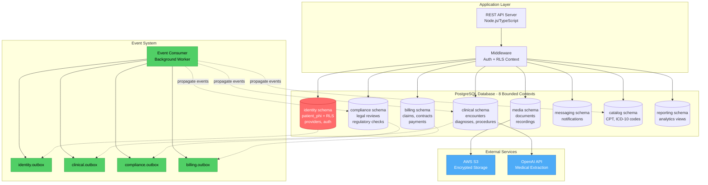

# TODO: Add Architecture Diagram

You need to create `architecture.png` or `architecture.svg` for this case study.

## Option 1: Use This Mermaid Code (Easiest)

Copy this code to https://mermaid.live, then export as PNG or SVG:

## Option 2: Draw It Yourself

Create a diagram showing:

**Main Components:**
- Application layer (API server)
- 8 database schemas (boxes)
- Event outbox tables (one per schema)
- Event consumer (background worker)
- External services (S3, AI APIs)

**Key Relationships:**
- API connects to all schemas (solid lines)
- Each schema has its own outbox (dotted lines)
- Event consumer reads outboxes (solid lines)
- Event consumer writes to other schemas (dotted lines)
- Highlight `identity` schema in different color (PHI data)

**Tools:**
- Excalidraw: https://excalidraw.com
- Draw.io: https://app.diagrams.net
- Or screenshot from your actual architecture docs

## Option 3: Simple Boxes and Arrows

Even a hand-drawn diagram (photographed clearly) showing the 8 bounded contexts with event flow is better than nothing!

---

**Once created, save as `architecture.png` or `architecture.svg` in this folder and delete this file.**
