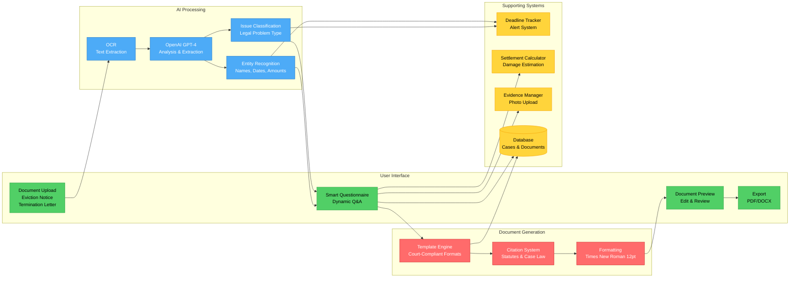

# TODO: Add Architecture Diagram

You need to create `architecture.svg` or `architecture.png` for this case study.

## Option 1: Use This Mermaid Code (Easiest)

Copy this code to https://mermaid.live, then export as PNG or SVG:

## Option 2: Flow Diagram

Create a diagram showing the document processing flow:

**Step 1: Document Upload**
- User uploads eviction notice or termination letter
- System detects document type

**Step 2: AI Analysis**
- OCR extracts text
- AI identifies entities (names, dates, amounts)
- System classifies legal issues

**Step 3: Smart Questionnaire**
- Dynamic questions based on detected issues
- User provides additional context
- System validates responses

**Step 4: Document Generation**
- Template selected based on issue type
- Auto-populate from extracted data + user answers
- Apply court formatting (font, spacing, citations)

**Step 5: Review & Export**
- User reviews generated document
- Make edits if needed
- Export as PDF or DOCX

**Tools:**
- Excalidraw: https://excalidraw.com
- Draw.io: https://app.diagrams.net
- Lucidchart (if you have access)

## Option 3: System Architecture Diagram

Show the main components:
- Frontend (Next.js)
- API Server (Node.js)
- AI Integration (OpenAI)
- Database (PostgreSQL)
- File Storage
- Background Jobs (document processing queue)
- Email/SMS alerts

## Option 4: Use Screenshots

If you have screenshots from OpenCourt showing:
- Document upload screen
- AI extraction results
- Generated document preview

Combine them into a single flow image showing the process.

---

**Once created, save as `architecture.svg` or `architecture.png` in this folder and delete this file.**
