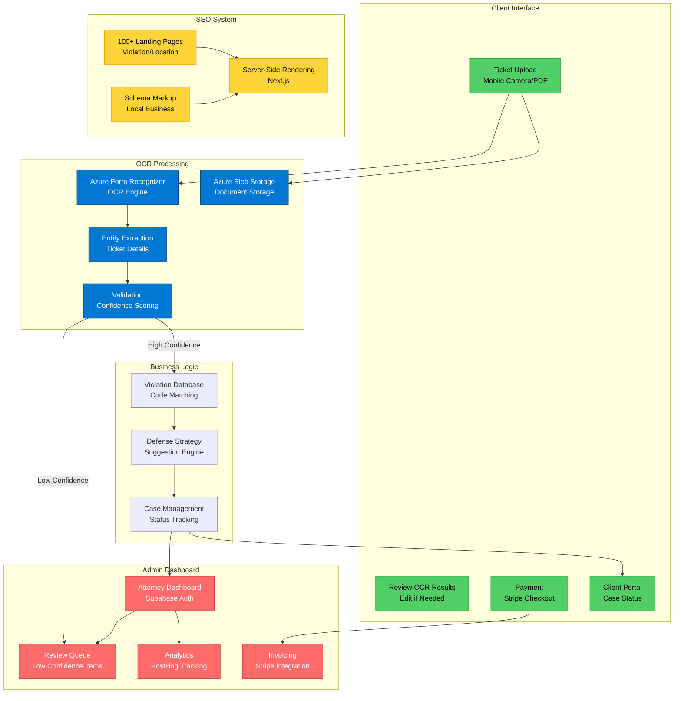

# TODO: Add Architecture Diagram

You need to create `architecture.png` or `architecture.svg` for this case study.

## Option 1: Use This Mermaid Code (Easiest)

Copy this code to https://mermaid.live, then export as PNG or SVG:

## Option 2: Simple Flow Diagram

Create a diagram showing the ticket processing workflow:

**Client Flow:**
1. Upload ticket (mobile photo or PDF)
2. Azure OCR extracts ticket details
3. System validates extracted data
4. Client reviews results
5. Violation code matched to database
6. Defense strategies suggested
7. Client books consultation (Stripe payment)

**Attorney Flow:**
1. View submitted tickets in dashboard
2. Review OCR extractions (edit if needed)
3. Assign case to attorney
4. Track case status
5. Generate invoices
6. View analytics

**SEO System:**
- 100+ pre-rendered pages (violations × locations)
- Server-side rendering for SEO
- Schema markup for rich snippets

**Tools:**
- Excalidraw: https://excalidraw.com (hand-drawn style)
- Draw.io: https://app.diagrams.net (professional flowchart)

## Option 3: Screenshot Flow

If you have screenshots from TicketToro:
1. Ticket upload screen (mobile view)
2. OCR extraction results
3. Violation analysis output
4. Admin dashboard view

Combine them into a single image showing the complete workflow.

## Option 4: System Architecture

Show the main system components:

**Frontend:**
- Next.js application
- Mobile camera integration
- Responsive design

**Backend:**
- Next.js API routes
- Supabase database
- Azure Form Recognizer
- Stripe integration

**Storage:**
- Azure Blob Storage
- Supabase file storage

**Marketing:**
- SEO landing pages
- Schema markup
- SSR for indexing

---

**Once created, save as `architecture.png` or `architecture.svg` in this folder and delete this file.**
